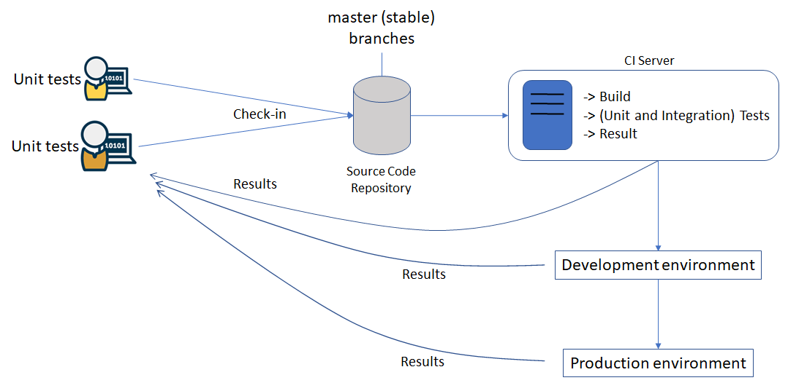
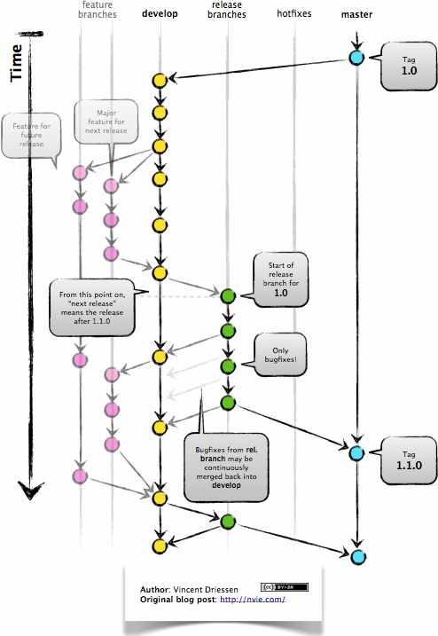
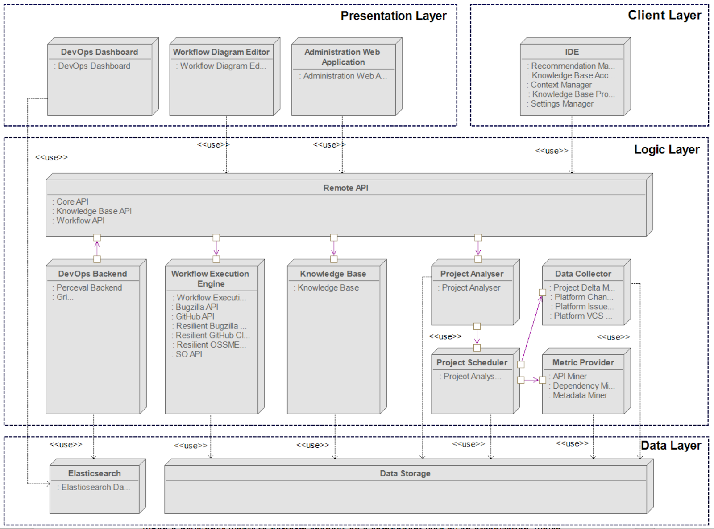

# SCAVA Development Process

## Introduction

This document presents the guidelines about the processes and tools supporting the development of the Scava platform. In particular, Sec 2 presents an overview of the main development workflow by highlighting the main tools of the supporting development infrastructure. Section 3 mentions peculiar conventions that have to be adopted to write source code and to perform changes. Section 4 makes a list of tools supporting communication and collaboration among the different partners. Section 5 gives some important remarks related to the Scava project and its development.

## Process overview

The development of the Scava components and of the integrated platform should follow the process shown in the following figure. Essentially, the development relies on the availability of a source code repository (to enable collaborative development) and of a Continuous Integration Server (to do the building and integration on behalf of the developers). Different deployment environments can be considered for deploying the built system.

It is important to remark that Continuous Integration (CI) requires that the different developers have self-testing code. This is code that tests itself to ensure that it is working as expected, and these tests are often called unit tests. When all the unit tests pass after the code is integrated, developers will get a green build. This indicates that they have verified that their changes are successfully integrated together, and the code is working as expected by the tests.

The different elements shown below are individually described in the remaining of the section.


Figure 1. Overview of the CROSSMINER development process and tools.

### Source Code Repository

Different branches will be created in the repository. In particular, the `master` branch is the main branch and represents the released state of the product. It is always clean, builds and runs all the tests successfully. The `dev` branch contains the most recent code integrated by partners before release.

Other branches will be created for the different features/components, which will be eventually merged in the `dev` branch. The name of each branch contains the id of the issue it is supposed to implement.

All source code, binary code and configuration needed to build a working implementation of the system will reside in a GitHub repository.

* Code: https://github.com/crossminer/scava
* Product documentation: https://github.com/crossminer/scava-docs
* Product deployment: https://github.com/crossminer/scava-deployment


Since all source code will be stored in a single GitHub repository, each developer will have a working copy of the entire project. To simplify collaboration, each component will be contained in one subdirectory within the source structure (see Sec. 3 for details).

By taking inspiration from https://datasift.github.io/gitflow/IntroducingGitFlow.html the branching model that will be followed will resemble that shown in Fig. 2 without making use of the release and hotfixes branches. Details about the change conventions, pull requests, etc. are given in Sec. 3.


Figure 2: Branching model

### Tests

Each branch must have the corresponding unit tests. The dev branch must have integration tests and the unit tests of all the features that have been already merged as shown below.


Figure 3: Explanatory master and branches

```
BRANCH: Set of branches
TEST: Set of tests
INTGRATION_TEST < TEST
UNIT_TEST < TEST

function test: BRANCH -> TEST

test(master) -> test(cool-feature)
    ⋃ {itu, … itz}
```

### Continuous Integration Server

Continuous integration (CI) involves integrating early and often, so as to avoid the pitfalls of "integration hell". The practice aims to reduce rework and thus [reduce cost and time](https://en.wikipedia.org/wiki/Continuous_integration).

A complementary practice to CI is that before submitting work, each programmer must do a complete build and run (and pass) all [unit tests](https://en.wikipedia.org/wiki/Unit_tests). [Integration tests](https://en.wikipedia.org/wiki/Integration_testing) are usually run automatically on a CI server when it detects a new commit. In particular, a CI server provides developers with at least the following functionalities:

* Allow developers to write unit tests that can be executed automatically
* Perform automated tests against newly written code
* Show a list of tests that have passed and failed
* Quality analysis on source code
* Perform all the necessary actions to create a fully functioning build of the software when all tests have passed

The currently used CI server is available at http://ci5.castalia.camp:8080/

### Development and Production environments

According to the DoW we have not promised the availability of a public installation of the CROSSMINER platform (i.e., a production environment). However, in order to implement the different use cases, use case partners are provided with docker images enabling the local installation of the whole CROSSMINER platform.

## Naming and change conventions

The repository will contain the code of the high-level components shown in Table 1


| Components | Corresponding folder in repository | Leader |
|------------|---------------------------------|-----------|
| DevOps Dashboard  | | BIT |
| Workflow Diagram Editor | /crossflow | YORK |
| Administration Web Application | /administration | SFT |
| IDE | /eclipse-based-ide | FEA|
| API Gateway | /api-gateway | SFT |
| DevOps Backend | | BIT |
| Knowledge Base | /knowledge-base | UDA |
| Project Analyser | /metric-platform | SFT |
| Data Collector | /metric-platform | SFT |
| Project Scheduler | /metric-platform | SFT |
| Metric Providers | /metric-platform | YORK, CWI, AUEB, EHU |
| Data Storage | /metric-platform | SFT |
| Web-based dashboards | /web-dashboards | BIT |

Table 1: Leaders and Contributors of the CROSSMINER Deployment diagram nodes



Figure 4: Scava components architecture

For each component a corresponding folder is available in the repository. Changes must have a CR (i.e. issue) entry for traceability. In particular, the requirements and objectives of each Scava components will be detailed in the relevant deliverables and they will be added in the form of items in the provided Bug Tracking infrastructure. In this way progress on the implementation of each requirement can be tracked. Thus:

* when developers want to operate changes they have to create corresponding issues in the bug tracking system for traceability reasons;
* when a developer wants to perform changes on a component led by an organization, which is different than that the developer belongs to, a pull request (PR) has to be done. Such a PR will be managed by one of the members of the organization leading the component affected by the changes in the PR.

The partner in charge of managing the development of a component will be free to organize the content of the corresponding subdirectory in any way as long as the following standard files/directories are contained in the component folder:

* `readme.md` : this file will contain the entry-point to all documentation for the component.
* `Jenkinsfile`: in order to compile the component, run tests, etc on the CI server.
* `test`: this is a folder containing the unit and/or integration tests.

As a reference, please have a look at https://github.com/crossminer/scava/tree/master/knowledge-base

The following items are typical practices when applying CI:
* Maintain a code repository
* Automate the build
* Make the build self-testing
* Everyone commits to the baseline every day
* Every commit (to baseline) should be built
* Keep the build fast
* Test in a clone of the production environment
* Make it easy to get the latest deliverables
* Everyone can see the results of the latest build
* Automate deployment

## Communication and collaboration means

The development activities can be done by exploiting different communication and collaboration means. In particular, currently the consortium members have the availability of:

* Slack channel: http://crossminer.slack.com
* Eclipse Mailing lists: https://accounts.eclipse.org/mailing-list/scava-dev
* GitHub repository for documentation: https://github.com/crossminer/scava-docs/


